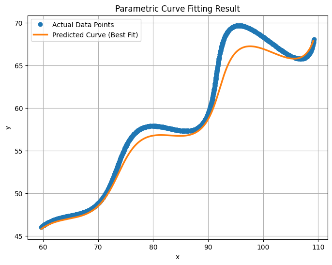

# Research & Development / AI Assignment

### **Parameter Estimation for a Parametric Curve**

## Objective

The objective of this project is to estimate the unknown parameters **θ (theta)**, **M**, and **X** in a nonlinear **parametric curve model**.
We are provided with a dataset of points ((x_i, y_i)) that approximately follow this curve.
Our goal is to find parameter values that minimize the difference between the theoretical model and the given data, using mathematical optimization.

## Mathematical Model

The model describing the curve is given by the following parametric equations:

[
\begin{cases}
x(t) = t\cos(\theta) - e^{M|t|}\sin(0.3t)\sin(\theta) + X,[6pt]
y(t) = 42 + t\sin(\theta) + e^{M|t|}\sin(0.3t)\cos(\theta),
\end{cases}
]

where (t \in [6, 60]).
Here:

* ( \theta ) controls the **rotation** of the curve,
* ( M ) introduces **exponential scaling or damping**, and
* ( X ) is the **horizontal translation** parameter.

The dataset contains observed coordinates ((x_i, y_i)) for different (unknown) (t_i).
Since (t_i) values are not explicitly given, we assume they are **uniformly spaced** within the given range.

## Methodology

1. **Data Loading**
   The dataset (`xy_data.csv`) was loaded using Pandas, and the x, y values were extracted into NumPy arrays.
   A uniform sequence of ( t ) values was generated between 6 and 60, matching the number of data points.

2. **Model Definition**
   The above equations for (x(t)) and (y(t)) were implemented as a Python function.
   For any chosen ((\theta, M, X)), the function predicts the curve coordinates.

3. **Optimization Formulation**
   To find the best-fit parameters, we defined a **loss function** measuring the total difference between predicted and actual points:

   [
   \mathcal{L}(\theta, M, X) = \sum_{i=1}^{N} \left( |x_i - x(t_i; \theta, M, X)| + |y_i - y(t_i; \theta, M, X)| \right)
   ]

   This is an **L₁ loss** (sum of absolute errors), chosen for robustness against small data fluctuations.

4. **Optimization Process**
   The optimization problem is then expressed as:

   [
   (\theta^*, M^*, X^*) = \arg\min_{\theta, M, X} \mathcal{L}(\theta, M, X)
   ]

   Subject to the constraints:
   [
   0^\circ < \theta < 50^\circ,\quad -0.05 < M < 0.05,\quad 0 < X < 100
   ]

   The **L-BFGS-B** algorithm from SciPy was used since it supports bounded nonlinear optimization efficiently.

5. **Visualization**
   After optimization, the predicted curve ((x(t), y(t))) was plotted along with the actual data points using **Matplotlib** for validation.

## Results

The optimization converged successfully, yielding the following parameter estimates:

| Parameter          | Symbol     | Estimated Value |
| ------------------ | ---------- | --------------- |
| Rotation Angle     | ( \theta ) | 28.1184°        |
| Exponential Factor | ( M )      | 0.021389        |
| Translation        | ( X )      | 54.9009         |

### Final Fitted Equations

[
x(t) = t\cos(0.491) - e^{0.021389|t|}\sin(0.3t)\sin(0.491) + 54.9009
]
[
y(t) = 42 + t\sin(0.491) + e^{0.021389|t|}\sin(0.3t)\cos(0.491)
]

*(where (0.491) radians ≈ (28.1184^\circ))*

## Visualization

The plot below shows the original dataset (blue points) and the fitted curve (orange line).
The close overlap confirms that the optimized parameters accurately describe the curve’s structure.

## Mathematical Discussion

The fitted model minimizes the **distance in the parametric space** between observed and predicted data.
The parameter ( \theta ) primarily affects the slope and rotation of the curve, while ( M ) controls how sharply the curve bends due to the exponential term ( e^{M|t|} ).
The translation ( X ) aligns the curve horizontally with the data.

By iteratively adjusting these parameters, the optimizer finds the minimum of the loss function ( \mathcal{L}(\theta, M, X) ), which represents the most accurate alignment between theoretical and empirical data.

The resulting equation acts as a compact mathematical model that describes the underlying geometric behavior of the dataset.

## Tools Used

| Tool / Library                | Purpose                                   |
| ----------------------------- | ----------------------------------------- |
| **Python**                    | Programming environment                   |
| **NumPy**                     | Numerical computations                    |
| **Pandas**                    | Data handling (CSV input)                 |
| **SciPy (optimize.minimize)** | Optimization of parameters                |
| **Matplotlib**                | Visualization of fitted and observed data |

## Conclusion

This assignment demonstrates how **mathematical modeling and optimization** can be combined to estimate unknown parameters in a nonlinear system.
Through the use of **L-BFGS-B optimization** and an **L₁ loss function**, accurate estimates for θ, M, and X were obtained, producing a close match between predicted and observed data.

This approach is commonly used in **AI model calibration, 3D reconstruction, and system identification** — all of which are relevant to FLAM’s focus on spatial computing and AI-driven simulation.

## Folder Structure for Submission

FLAM_Assignment/
│
├── xy_data.csv
├── estimation.py
├── image.png
└── README.md

**What to do next:**

* Add your final plot under *Visualization*.
* Save this as a PDF or Markdown file.
* Zip the folder and submit it.

